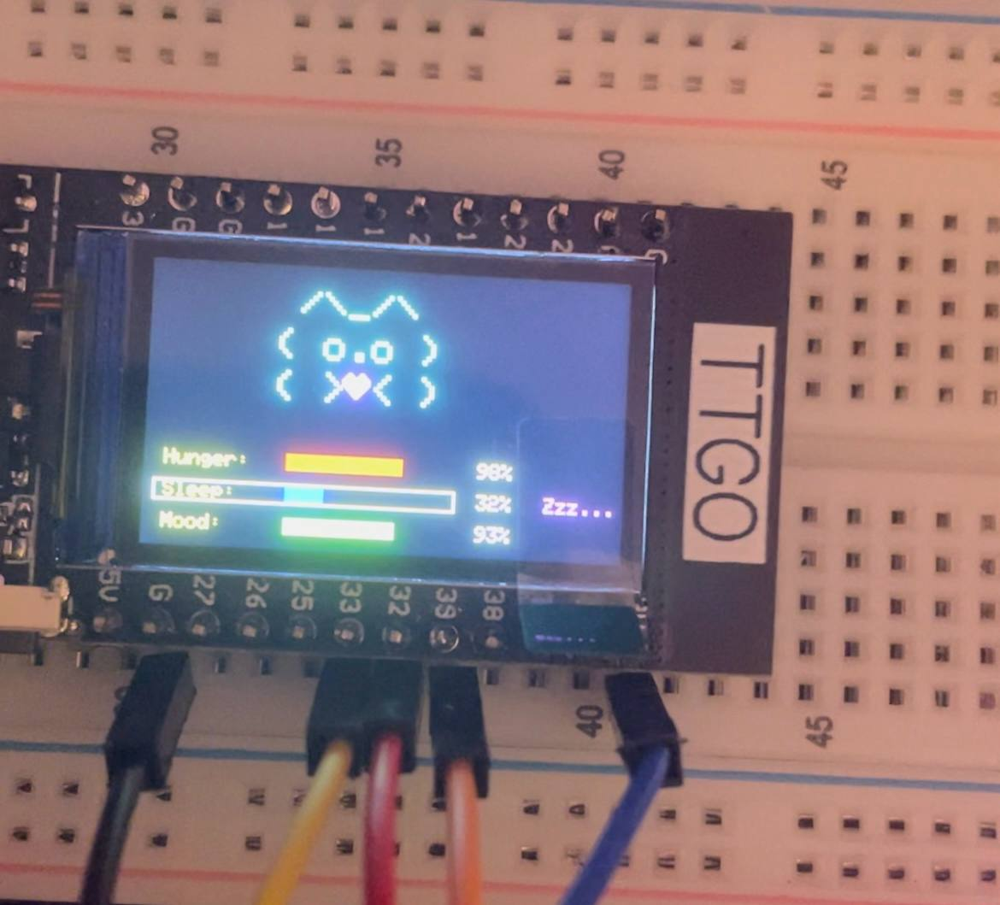

# miniTamagotchi_TTGO

Mały projekt w trakcie rozbudowywania. Interaktywny mini-Tamagotchi z wyświetlacze ST7789 i podpiętym joystickiem na bazie TTGO T-Display (ESP32)
Projekt symuluje prostego wirtualnego zwierzaka - kotka zrobionego ze znaków, którego stan fizyczny można kontrolować joystickiem.

## Funkcje
- Statyczna grafika kotka na ekranie

<pre>
("  /\\_/\\  ");
(" ( o.o ) ");
(" (> ♡ <)");
</pre>

  
- Trzy parametry życiowe: Hunger (czerwony pasek), Sleep (niebieski pasek), Mood (zielony pasek)
- Joystick pozwala:
    - przełączać między paskami (góra/dół) 
    - doładowywanie danej potrzeby (kliknięcie buttona), podczas doładowywania pokazują się komunikaty obok pasków (np. Hunger: Mniam!, Sleep: Zzz..., Mood: Hihi!)
- Jeśli jakiś parametr osiągnie stan krytyczny (np. Hunger == 0, Mood == 0, Sleep == 100), kotek choruje "Kitty is sick :("
- Aby uleczyć kotka i przywrócić go, należy wcisnąć przycisk na joysticku "Press button to heal"

## Wymagania sprzętowe - podstawowa wersja
  - TTGO T-Display (ESP32 z wyświetlaczem ST7789)
  - Joystick (X, Y jako wejścia analogowe + przycisk)
  - Zasilanie przez USB
 
## Wymagane biblioteki Arduino
- Adafruit GFX Library
- Adafruit ST7789 Library

## Podłączenie (PINOUT)
| Funkcja    | Pin ESP32     |
|------------|---------------|
| TFT_MOSI   | GPIO 19       |
| TFT_SCLK   | GPIO 18       |
| TFT_CS     | GPIO 5        |
| TFT_DC     | GPIO 16       |
| TFT_RST    | GPIO 23       |
| TFT_BL     | GPIO 4        |
| JOY_X      | GPIO 39 (ADC) |
| JOY_Y      | GPIO 32 (ADC) |
| JOY_SW     | GPIO 33       |

## Użycie
1. Wgrać kod na płytkę TTGO T-Display
2. Ekran wyświetli kotka oraz paski stanu, które wraz z upływem czasu będą się zmieniać
3. Przechylić joystick w górę/dół, aby wybrać dany parametr opisujący stan
4. Wcisnąć joystick, by uleczyć dany stan kotka

## Dalsze plany na rozwój:
- dźwięki/melodyjki (np. głośniczek, buzzer)
- diody LED RGB, migające lub alarmujące o stanie
- mini-gry (np. złap jedzenie, odbij piłeczkę, skoki itp.)
- połączenie się z innymi "graczami"
- animacje (może być problem z danym wyświetlaczem, dlatego możliwy upgrade sprzętowy)

## Zdjęcia

Projekt stworzony przez oclau – 2025, 
na potrzeby zaliczenia projektu z przedmiotu na studiach.
Możliwy dalszy rozwój projektu w celach rozrywkowych, bo w sumie fajna zabawa!!! :)
